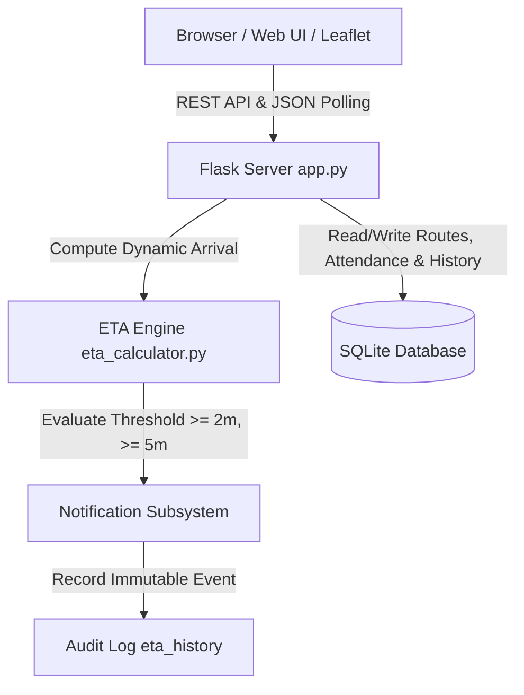

# System Architecture - School Bus ETA Prototype

This document outlines the modular architecture and end-to-end component flow of the Live School-Bus ETA system.

---

## Core System Flow

```
Browser
   ↓  (Interactive UI, Leaflet Maps, Rest API Requests)
 Flask
   ↓  (Request routing, state coordination, controllers)
ETA Engine
   ↓  (Haversine travel time + attendance dwell + traffic delay)
SQLite
   ↓  (Persistent state, route geometry, failure registry)
Notification
   ↓  (Meaningful delay filtering, threshold-based alerts)
Audit Log
      (Immutable chronological ledger of all ETA changes)
```

---

## Architectural Block Diagram



---

## Component Layers

1. **Browser / Frontend Layer (`templates/`, `static/`)**:
   - Bootstrap 5 responsive layouts for admin and parent operations.
   - Leaflet.js with OpenStreetMap tiles for real-time bus tracking and route polylines.
   - Chart.js for comparative performance visualizations (MAE, RMSE, enquiry volume).
   - Async Fetch API for polling simulation state and triggering failure injections.

2. **Application Server (`app.py`)**:
   - Serves HTML views and exposes lightweight REST API endpoints.
   - Enforces meaningful change thresholds and store-and-forward synchronizations.
   - Dispatches simulation control signals (Start, Pause, Reset, 7-Step Demo).

3. **ETA Prediction Engine (`eta_engine/`)**:
   - `eta_calculator.py`: Evaluates travel time based on vehicle position, speed, stop sequence, and Haversine distance.
   - `baseline.py`: Static schedule-only ETA calculation serving as empirical baseline.
   - `explanation.py`: Attaches human-readable factor decompositions (Traffic, Boarding, Dwell).
   - `fallback.py`: Provides safe fallback values under GPS, traffic, or sensor failure.

4. **Simulation & Telemetry Layer (`simulator/`)**:
   - `simulation.py`: Clock-driven movement loop with waypoint navigation and dwell countdowns.
   - `failure_simulator.py`: Injects telemetry faults (GPS loss, Network drop, Traffic disconnect, Sensor anomaly).
   - `data_generator.py`: Produces 550+ trip records for empirical offline evaluation.

5. **Persistence & Audit Layer (`database/`)**:
   - SQLite database (`database/school_bus.db`) storing buses, routes, stops, students, attendance, customer commitments, feedback, and `eta_history`.
   - Complete audit trail preserved for historical accountability.
