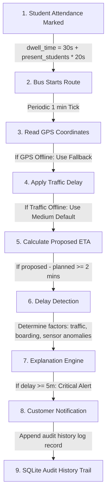

# Field Workflow

This document illustrates the chronological progression of data updates and calculations during a school bus transit run.

## Workflow Pipeline

## Step-by-Step Breakdown

1. **Student Attendance Marked**:
   - Before the bus departs or at stop pickup points, coordinators toggle present/absent states.
   - Dwell time is computed: `dwell_time = 30 + (present_students * 20) seconds`.

2. **Bus Starts Route**:
   - Bus status switches from `INACTIVE` to `ON_ROUTE`. The simulation clock starts.

3. **Read GPS Coordinates**:
   - Real-time GPS location is read. If GPS fails, the system switches to fallback mode using the last known location from SQLite.

4. **Apply Traffic Delay**:
   - Current traffic delay is queried: LOW (0m), MEDIUM (3m), HIGH (7m). If feed fails, fallback defaults to MEDIUM.

5. **Calculate Proposed ETA**:
   - ETA = Current Time + Remaining Travel Time (Haversine distance / speed) + Dwell Times + Traffic Delay.

6. **Delay Detection**:
   - The system checks the difference between the new ETA and the previously logged ETA. If change >= 2 minutes, it generates an update.

7. **Explanation Engine**:
   - Decomposes the difference into traffic, student boarding, dwell, and GPS delay components.

8. **Customer Notification**:
   - Generates notifications for parents (in-app alerts):
     - `🟢 On Time` (no change)
     - `🟡 Warning` (delay >= 2 mins)
     - `🔴 Critical Alert` (delay >= 5 mins)

9. **SQLite Audit History Trail**:
   - The ETA change, including all inputs, sensors, and network statuses, is logged as an immutable history row. If network is offline, the event is saved in the Store-and-Forward queue and flushed once restored.
